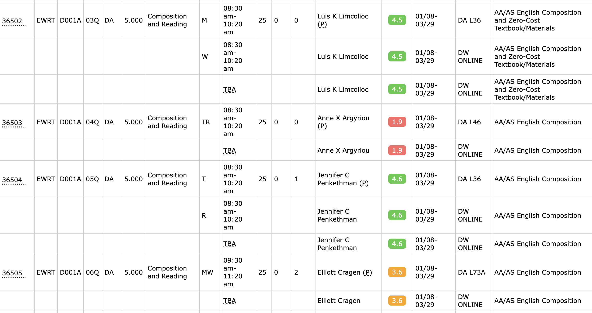
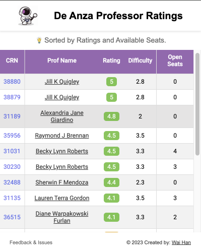
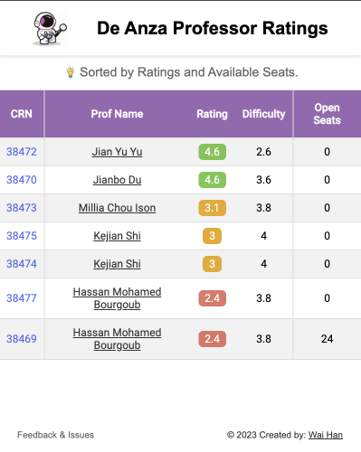
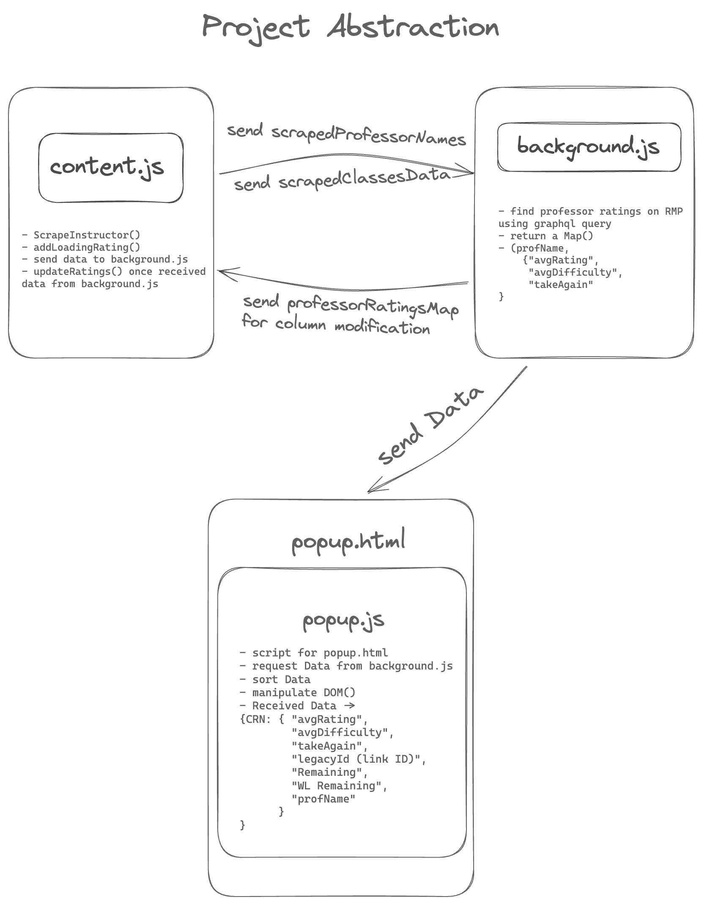

# De-Anza-RMP

    

Enhance your class registration with **De Anza Rate My Professors Extension (De-Anza-RMP)**, a Chromium-based browser extension. Seamlessly integrating professor ratings into the registration page, this tool empowers students to make well-informed decisions when selecting classes.

*Download for Free* in <a href="http://bit.ly/deanzaRmp" target="_blank">Chrome Web Store </a>
#### <ins>Notes on Enhanced Safe Browsing Warning:</ins>

According to [Google](https://support.google.com/chrome_webstore/answer/2664769?hl=en-GB#zippy=%2Cinstall-with-enhanced-safe-browsing),

> Extensions are considered trusted when they’re built by a developer who follows the Chrome Web Store Developer Programme Policies.

> For new developers, it generally takes a few months to become trusted. Eventually, we strive for all developers with compliant extensions to reach this status upon meeting our Developer Programme Policies.

I just created a Google developer account for this extension and thus it is possible that some people may get this warning.

However, this project follows Chrome Web Store Developer Programme Policies, and hopefully, the extension will become trusted in a few months.

If you have the error, you can simply click on `Continue to Install` to proceed. 

**[NO DATA IS COLLECTED FROM USERS]**

## Features

- Displays professor ratings on FHDA MyPortal registration page.
- Provides quick access to professor reviews.
- Link Professors directly to De Anza Faculty page.  [thanks to [Erik](https://github.com/erik-ksth)] 

## Demo

    
    
     
    

        
        
    

## Developer Installation
If you want the latest version or you're a developer, this is the preferred way to install the extension. It takes several days to publish on Chrome Store since Google reviews the code, manifest, permissions, and privacy beforing allowing devlopers to release a newer version.

1. Download or clone this repository: `git clone https://github.com/waihankan/De-Anza-RMP.git`
2. Open the Extension Management page by navigating to `chrome://extensions`.
   - Alternatively, open this page by clicking on the Chrome menu, hovering over **More Tools**, and selecting **Extensions**.
3. Enable Developer Mode by clicking the toggle switch next to **Developer mode**.
4. Click the **Load unpacked** button and select the extension directory (`De-Anza-RMP`).

## Usage

- Once installed, navigate to the registration page. The professor ratings will automatically appear next to each professor's name.
- Click on the Extension button to check all the classes and professor ratings **sorted** in order of **Average Rating** and **Available Seats**.
- Prior to utilizing the extension, kindly review the Disclaimer provided below. By using the extension, you acknowledge your agreement with the stated conditions and an understanding of associated risks. 

# ☕ Buy Me a Coffee
If you find this project helpful or just want to show your appreciation, consider buying me a coffee! Your support helps keep the project alive and contributes to future development.
 
 

## Disclaimer

By using this extension, you acknowledge that you have read and understood the [disclaimer](DISCLAIMER.md) associated with it. All risks related to the use of this extension are assumed by the user. The developer is not responsible for any damages or losses related to the use or misuse of this extension.

Please read the [disclaimer](DISCLAIMER.md) for more information.

## Project Layout

## Contributing

We welcome contributions! Please see our [contributing guidelines](CONTRIBUTING.md) for more details.

## Privacy
#### Information Collection and Usage
We do not collect any personal information or data from users of the Extension. Your privacy is of utmost importance to us, and our commitment is to provide a secure and anonymous user experience.

#### Information Sharing
Since we do not collect any user data, we do not share any personal information with third parties. Rest assured, your privacy is our top priority, and your data remains confidential.

#### Changes to This Privacy Policy
We may update our Privacy Policy from time to time. Thus, we advise you to review this page periodically for any changes. We will notify you of any significant changes by posting the new Privacy Policy on this page.

## License

This project is licensed under the terms of the MIT license. See the [LICENSE](LICENSE) file for details.

## Acknowledgements

I would like to express gratitude to the following people and organizations:

- [Aung Bo Bo](https://github.com/aungbbo): For their invaluable ideas to the project.
- [Erik Hein](https://github.com/erik-ksth): For their code and design contributions.
